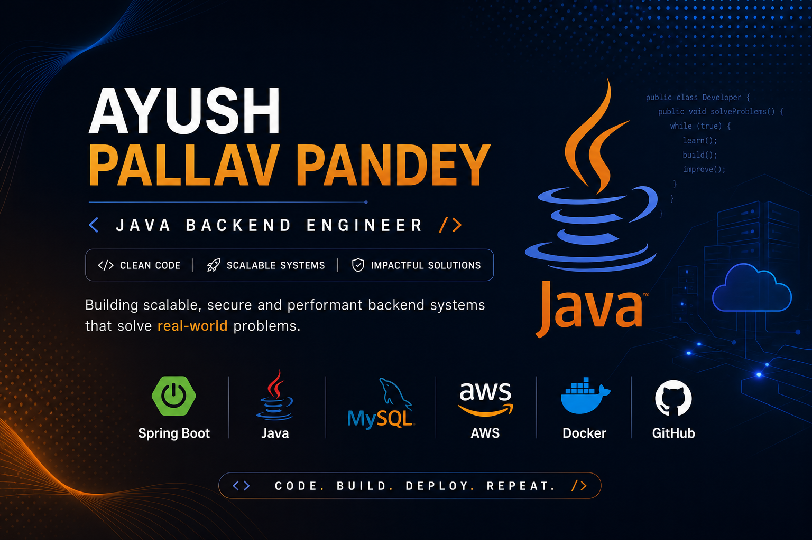

<div align="center">


<p align="center">
  
</p>

# 👋 Hi, I'm Ayush Pallav Pandey

**Java Backend Developer | Spring Boot | AWS | REST APIs**


- 🎓 Recent Graduate Computer Science Engineering Student
- ☕ Java Backend Developer
- 🌱 Currently learning AWS, Microservices, Kubernetes & System Design
- 💡 Passionate about scalable backend architecture
- 🚀 Preparing for Software Engineer & Java Backend roles


</div>

---
## 🛠️ Tech Stack

### Languages

<p>

</p>

### Backend

<p>

</p>

### Cloud & DevOps

<p>

</p>

### Tools

<p>

</p>

---
## 🚀 Backend Expertise

```text
Java
   │
Spring Boot
   │
REST APIs
   │
Spring Security
   │
JWT Authentication
   │
MySQL
   │
Docker
   │
AWS
   │
Microservices
```
## 📌 Featured Projects

| Project | Description | Tech |
|---------|-------------|------|
| 📚 AI-Assisted Book Management System | Spring Boot backend with authentication and AI-powered recommendations | Spring Boot • JWT • MySQL • Spring AI |
| 🚂 Railway Ticketing System | Backend reservation system with database integration | Java • JDBC • MySQL |
| 🔐 JWT Authentication API | Secure authentication and authorization | Spring Security • JWT |
| ☁️ AWS EC2 Deployment | Cloud deployment using EC2 | AWS • Docker |
| 💻 LeetCode Java Solutions | Daily DSA solutions in Java | Java • DSA |


## 🎯 Current Focus

- Spring Boot
- Spring Security
- JWT Authentication
- REST APIs
- Docker
- AWS
- CI/CD
- Microservices
- Data Structures & Algorithms
## 📊 GitHub Statistics

<p align="center">


</p>
<p align="center">


</p>
## 💻 LeetCode Journey

I solve Data Structures & Algorithms problems daily in Java to strengthen problem-solving skills and prepare for Software Engineering interviews.

### 📈 Current Goal

- 🎯 Solve **500+ LeetCode Problems**
- ☕ Language: **Java**
- 📚 Focus:
  - Arrays
  - Strings
  - Linked Lists
  - Trees
  - Graphs
  - Dynamic Programming
  - Greedy
  - Binary Search

🔗 **Repository:** https://github.com/ayush-pallavpandey/leetcode-java-solutions

## ☁️ AWS Cloud Journey

Currently learning and building cloud-native applications using AWS.

### Learning Roadmap

- ✅ EC2
- ✅ IAM
- ✅ S3
- ✅ RDS
- 🔄 Elastic Load Balancer
- 🔄 Auto Scaling
- 🔄 VPC
- 🔄 CloudWatch
- 🔄 ECS
- 🔄 CI/CD Deployment

### Current Project

🚀 Dockerized Spring Boot Application deployed on AWS EC2.

## 📜 Certifications

- Oracle Cloud Infrastructure AI Foundations *(In Progress)*
- Oracle Generative AI Professional *(In Progress)*
- AWS Cloud Learning Path *(In Progress)*
- NPTEL Cloud Computing

- ## 🌍 Open Source Goals

- Contribute to Spring Boot ecosystem
- Improve Java open-source projects
- Participate in Hacktoberfest
- Publish reusable backend libraries
- Build production-ready developer tools

- ## 📚 2026 Learning Roadmap

✅ Core Java

✅ Spring Boot

✅ REST APIs

✅ MySQL

✅ Docker

🔄 AWS

🔄 Spring Security

🔄 JWT

🔄 Microservices

🔄 Kubernetes

🔄 System Design


## 📫 Connect With Me

- 💼 LinkedIn: www.linkedin.com/in/ayushpandey-dev
- 📧 Email: ayushpallav7550@gmail.com
- 💻 GitHub: https://github.com/ayush-pallavpandey

- ---

<p align="center">

⭐ Thanks for visiting my profile ⭐

Building • Learning • Improving Every Day 🚀

</p>
- 
